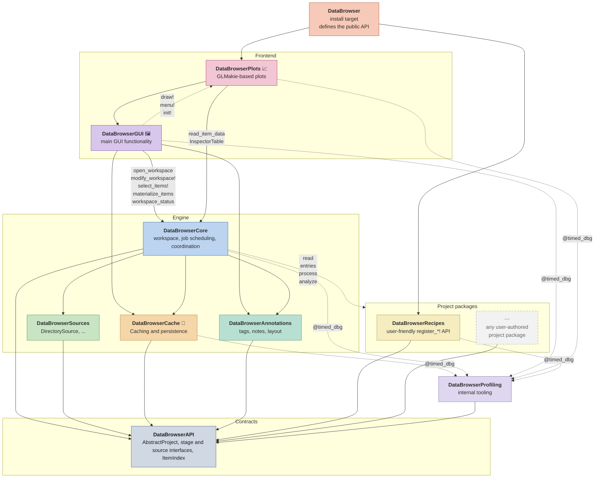
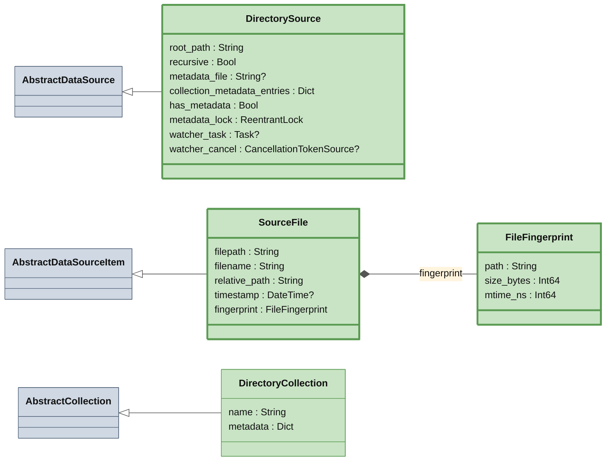
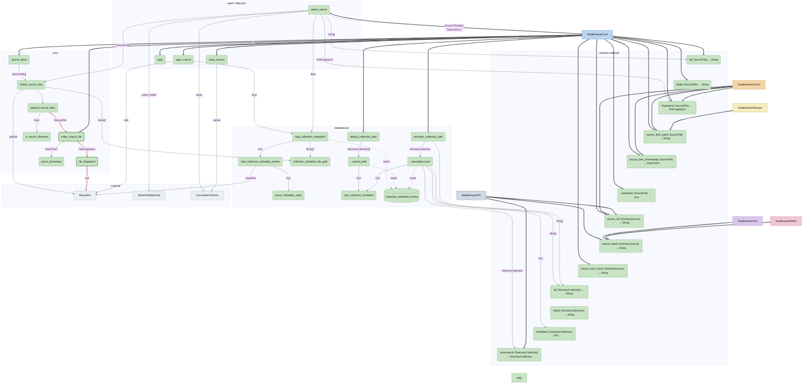

# DataBrowser Architecture

## What this is

DataBrowser is a Julia working environment for data projects. It should be strictly
better than opening a REPL, finding files, loading them, extracting useful tables, computing values,
and writing figure code by hand. The app makes that workflow interactive: open a project, browse the
source structure, select collections or items, inspect data-derived values, and switch plots or views
without repeating the same parsing work.

Project code should describe the project in the same terms a script would use: which logical items a
source item contains, how to load data for those items, and how to present that data. The
package owns scanning, cache storage, background jobs, and UI state.

The intended experience is live and composable. A project can stay open while source files are added
or changed, and the browser should update without forcing the user back through startup or manual
reload steps. Views should be able to follow selections, collections, or matching rules, so a plot or
inspection tool can continue to show the relevant data as the source tree changes. Built-in
visualizers should handle common inspection tasks, while project code adds only the interpretation
and presentation details that are specific to the experiment.

## Package map

A solid arrow from A to B means A depends on B at compile time: A needs B to build.
A dotted arrow from A to B means A calls functions whose methods live in B through dispatch, even though A has no dependency on B.
🦆 marks DuckDB, 📈 GLMakie, 🖼 CImGui / GLFW.



## Core Flow

```
source item → interpret → logical data → process → analyze → collection process/analyze → views
                 │             │             │
                 └─ index      └─ DuckDB     └─ DuckDB + item metadata
```

A project/source implementation defines:

- interpreting each source item into logical data items
- processing one interpreted item
- computing per-item and per-collection metadata (item/collection `analyze`, collection `process`)
- defining project-specific visualizers when generic ones are not enough

The workspace owns:

- the open source(s) and their identity
- the progressively populated item index
- selection identities
- cache identity, freshness, storage, and repair
- scanning, cache work, progress, errors, and cancellation
- work dependency graph state and source fallback

The browser owns windows, controls, filters, and temporary rendering state. Annotations store
user-authored tags, notes, and other user-authored metadata. Other package modules own generic
visualizers, workflow persistence, and figure composition. User code should not know whether data
came from memory, cache, or the source. Package code does not know the meaning of a source item
beyond the contract methods it calls.

## Subpackages

Each package gets two views. A class diagram shows its data model: the structs, their fields, and
how they subtype the API abstractions and compose. The call flow diagram shows which functions
call which as arrows, with A -data-> B meaning "A calls B, which returns `data`".

A solid arrow is a call, labelled with the value the callee returns.
External calls from other packages are shown as thicker arrows.
"hot path" calls which are very frequent and performance-critical are shown in red.
A dashed arrow is data written to or read from storage.

A thick border marks a symbol the package exports.
A `?` after a field type means the field may be `nothing`.

### DataBrowserSources

#### Data model



#### Call flow


