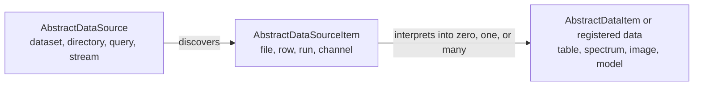
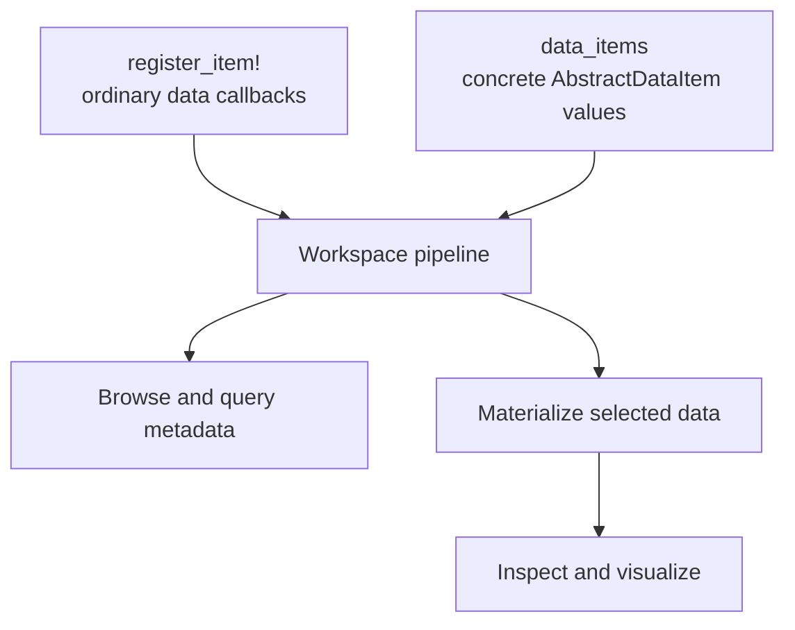
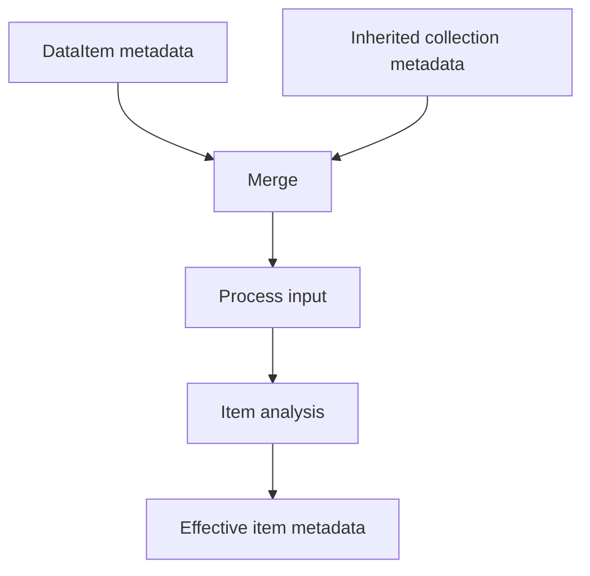
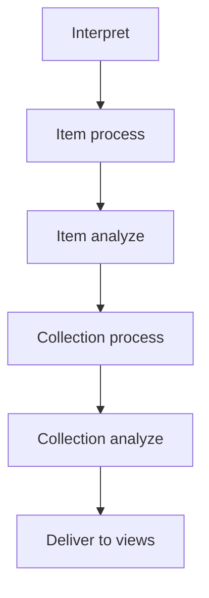

# Data Model

DataBrowser separates physical discovery from logical data:



A source item is the unit of scanning, invalidation, progress, and source errors. A data item is the
unit users browse, select, inspect, process, and visualize. One file can contain one table, several
measurement cycles, or no recognized data at all.

## Two project styles

The registration API produces logical items from ordinary data. DataBrowser supplies identity,
labels, collection placement, and empty metadata when callbacks omit them.

The type API returns concrete `AbstractDataItem` values from `data_items`. Their Julia types remain
intact, so processing and visualization can use multiple dispatch.



## Identity

Workspace identity is assembled from stable parts:

```text
source identity
  + source-item identity
  + registration identity or concrete item type
  + sibling identity when one source item expands into several items
```

The common one-source-item-to-one-data-item case requires no explicit item identity. When a source
item expands into several logical items, DataBrowser uses their returned positions by default. An
entry supplies an explicit id when its sibling order can change. Stable explicit ids keep selection,
annotations, saved views, and cached results attached when siblings are inserted or reordered.

Registered and typed items share one identity rule: project code supplies at most a sibling key
(the registration `id` callback or `id(item)`), and interpretation mints the final item id once by
namespacing that key under the source item and kind. Project code never produces a final item id.

A registration name such as `:cycles` identifies the registered pipeline. It is not a property of
the data and does not replace the concrete type of a typed item.

## Labels and collections

An item label is its user-facing title. A collection is its canonical path in the browser hierarchy.
Registration callbacks describe it with strings:

```julia
["Chip A9", "Device D1", "IV"]
```

Registration readers can compute both while constructing a `DataItem`. Typed items implement
`item_label` or `collection` only when the source-derived defaults are not appropriate. Every item
answers `collection(item)` with the complete vector of concrete `AbstractCollection` values: the
registration adapter converts callback strings (or the source-directory default) into normalized
segments while the source is in hand, attaching source-owned collection metadata such as the
directory source's `metadata.txt` entries. Interpretation itself is dialect-blind.

Collections have variable depth. The last path segment is the leaf containing the item; preceding
segments are ordinary parent collections. Code does not assign fixed meaning to a particular depth.
Collection records retain no representative user value. Their deterministic ID is derived
from the parent ID, concrete collection type, and a canonical encoding of `id(collection)`.
The default `id(collection) = collection` means ordinary immutable collection structs require no
method. Override it only to exclude presentation or metadata state from the ID, or to return a
stable encodable value for a collection that contains unsupported state.

Labels and metadata are not compared to decide whether records coalesce. Julia equality remains the
collection type author's concern but is not a competing collection ID rule. The engine also
assigns compact integer surrogates for work and cache tables; saved selection and annotation state
uses the deterministic ID so it survives deleting and rebuilding generated cache state.
Values that resolve to the same deterministic ID must nevertheless project the same label and
metadata. Conflicting projections are rejected instead of making the displayed collection depend on
source processing order. Authoritative source metadata updates may replace those projections during
an explicit metadata refresh.

## Metadata

Metadata is a `Symbol`-keyed dictionary of scalar or homogeneous vector values suitable for display,
filtering, and queries. It is built in layers:



More specific and later layers win on key conflicts. Processing receives the effective metadata
available before item analysis. Views receive processed data and the final effective metadata.

Collection analysis produces metadata for the collection node itself. Collection processing returns
one rewritten data value per member and can use metadata from every member.

## Data pipeline

The item pipeline is deterministic and shared by both project styles:



Each stage receives the output of the preceding stage. Recomputing a stage replaces its previous
output. Sibling items may execute concurrently, so callbacks treat shared input data as read-only.

## Data and caching

Registration data implementing the Tables.jl interface is persisted natively when its column types
are supported. Other registration data remains available through the source and in-memory pipeline.

Typed items are source-backed and recreated through `data_items` when selected. Domain sources may
own their own loading cache. Cache policy changes how DataBrowser obtains a value; it does not change
the value delivered to processing or visualization.

## Live changes

Sources report additions, changes, removals, and metadata updates. The workspace invalidates only the
affected downstream work and keeps stable selections and views attached by identity. Re-running a
registration replaces its callbacks and recomputes the results owned by that registration.

The full method and callback reference is in [api.md](api.md).
