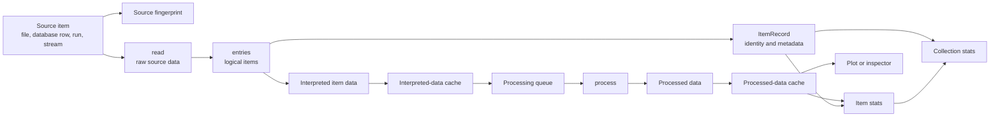
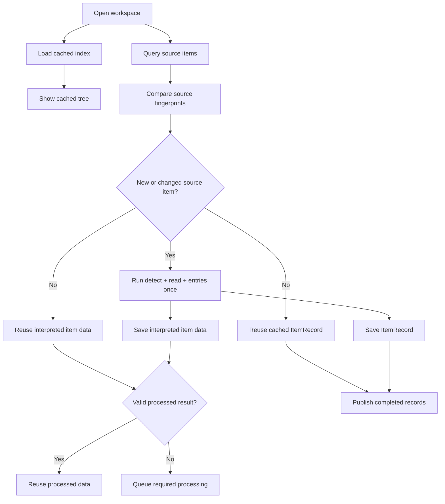
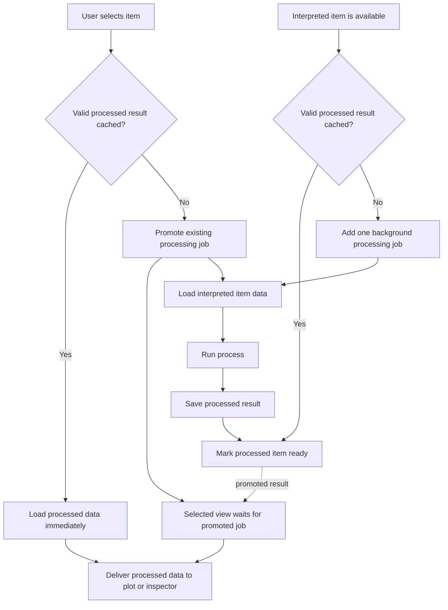
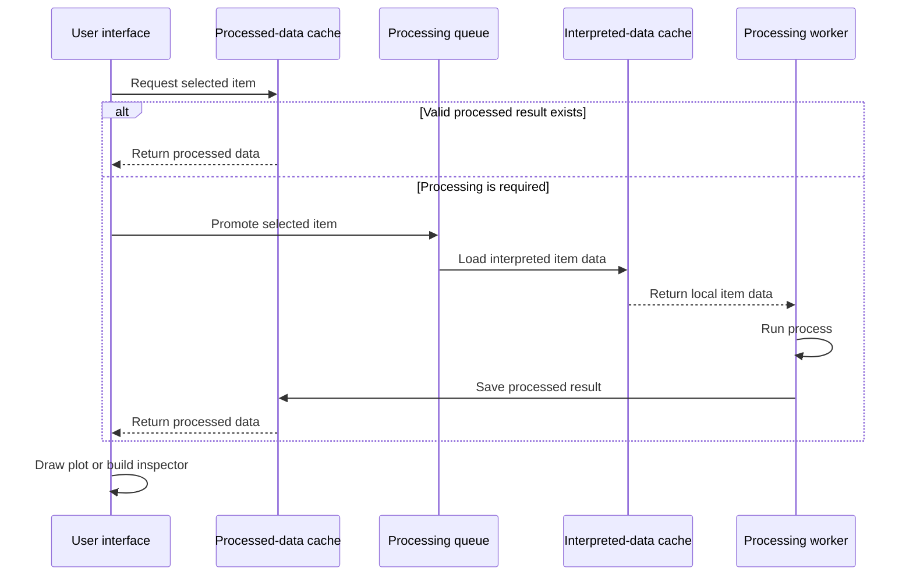
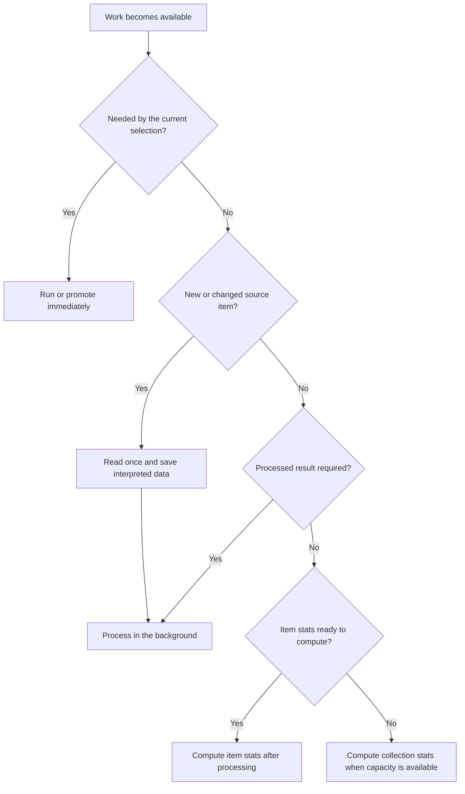

# Source, Cache, and Processing

**Status: Current architecture.**

## Purpose

MeasurementBrowser turns source data into a responsive local workspace. A source may be a local
folder, network storage, a database, an instrument, or another system with expensive access. The
package reads each changed source item once, saves the useful per-item result locally, and performs
later work from that local data.

Processing is required for every item. Its timing follows the user's attention:

- every item that needs processing enters a queue;
- background workers steadily process queued items;
- selecting an item immediately promotes its work;
- a valid processed result loads directly from the cache;
- plots and inspectors receive processed data.

This model gives source access, interpretation, processing, statistics, and plotting clear jobs. Each
result becomes the input to the next step, and each completed step can be reused independently.

## Terms

| Term | Meaning |
|---|---|
| Source item | One unit discovered by a source, such as a file, database row, run, or stream segment. It is the unit of source fingerprinting and refresh. |
| Raw source data | The value read directly from a source item by `read`, before `entries` divides or interprets it. |
| Interpreted item data | The per-item data produced by `entries`. One source item may produce zero, one, or many logical items. |
| `ItemRecord` | The small data-less description used by the index: identity, label, kind, collection, parameters, stats, and source-item identity. |
| Interpreted-data cache | Persistent local storage for the per-item data produced by `entries`. It protects the workspace from repeated source access. |
| Processed data | The result of applying `process` to interpreted item data. Plots and inspectors consume this form. |
| Processed-data cache | Persistent local storage for completed processing results. It protects the workspace from repeated computation. |
| Item stats | Values computed for one item after their required data exists. |
| Collection stats | Values computed from all relevant items in a collection after their required item results exist. |

The two data caches serve different purposes. The interpreted-data cache ends dependence on the
source item. The processed-data cache ends dependence on repeated computation.

## Cache Ownership And Policy

One project owns one predictable cache:

```text
DEPOT_PATH[1]/measurementbrowser/<project-name>/cache.duckdb
```

The project name is used unchanged after validation as one safe path component. The cache records the
source identity; the same project name cannot silently open a different source. Hash-derived cache
names and the package-level item LRU are absent.

`cacheable(item)` is the existing data-dependent opt-out. It is evaluated independently after
interpretation and processing. The built-in `DataItem` DataFrame path returns true; the low-level
default returns false. A false result removes any previous entry for that item and stage without
removing its record. DuckDB native columnar storage is currently the only persistent item-data
implementation.

## Complete Data Flow

The source fingerprint decides whether interpretation can be reused. Interpretation produces the
record used for browsing and the data used for processing. Processing produces the only data form
given to plots and inspectors.



An item may move through the queue while the user works elsewhere. Selection changes only its
priority; its meaning stays stable. The same `process` operation produces the same processed cache
entry whether a background worker or an interactive request starts it.

## Opening And Refreshing A Workspace

Opening a workspace first restores the local index so the existing tree can appear immediately. A
source refresh then lists current source items and compares their fingerprints with the stored
fingerprints.

An unchanged source item reuses its records, interpreted item data, and valid processed results. A
new or changed source item runs `detect`, `read`, and `entries`. Its interpreted item data is saved
before later processing relies on it.



Source access normally finishes at the interpreted-data cache boundary. If that data is absent,
processing uses the same `data_items` interpretation path as source fallback; disabling interpreted
caching never makes an item inaccessible.

## The Processing Queue

Every item requires a valid processed result. The scheduler first checks the processed-data cache. A
valid result completes the requirement immediately. Every remaining item receives one processing
job.

The queue keeps one job per item and processing identity. A selection promotes the existing job, so
interactive requests share work with the background queue. Completed results are written to the
processed-data cache before consumers receive them.



Processing can begin as soon as one interpreted item is stored. The source refresh and the
processing queue can therefore make progress together while keeping source reads and processing as
separate operations.

## Selection Timeline

A selection always asks for processed data. The processed-data cache supplies completed work. A
cache miss promotes the queued job, which reads interpreted data from local storage, processes it,
saves it, and then releases it to the view.



The plot callback receives processed data in both paths. Cache state changes the amount of work, while
the plotting contract stays constant.

## Work Priorities

The scheduler follows user-visible value. A current selection runs first. Reading and saving a new or
changed source item comes next because that local copy releases later work from source access.
Background processing fills the processed-data cache steadily. Statistics follow the data they
consume, and collection summaries use otherwise idle capacity.



Priority changes ordering. Cache identity and processing identity decide reuse. A promoted job and a
background job share the same cache keys and produce the same result.

## Invalidation

Source-item fingerprints are the current automatic invalidation mechanism. Independent source items
retain their completed work.

| Change | Reused | Recomputed |
|---|---|---|
| Source item fingerprint | Other source items and all of their results | `read`, `entries`, records, interpreted data, processed data, and dependent stats for the changed source item |
| Project interpretation, processing, statistics, or cache-policy code | Nothing automatically | Explicit **Rebuild Cache** replaces generated measurement data |

Automatic computation identity is a future goal and is not part of the current cache.

## Task Ownership And Safe Publication

Background work follows a small set of ownership rules:

- A source worker owns raw source data while `read` and `entries` use it.
- Small ready groups cross the cache boundary together through per-table cache buffers; each table has
  a single owning buffer, so writes to different tables never serialize against one another.
- A processing worker owns one processing result until the processed-data cache accepts it.
- Published `ItemRecord`s and hierarchy snapshots remain stable for readers.
- Background refresh builds replacement state privately and publishes completed snapshots.
- Queue entries carry stable item identities, so promotion changes priority without copying work.
- Cancellation stops unpublished work and leaves committed cache entries available for reuse.

These rules let the GUI, source workers, cache buffers, processing workers, and statistics workers run
concurrently while sharing completed values through clear boundaries.

## User-Visible Behavior

The intended experience follows a few direct rules:

- Opening a workspace shows the cached tree quickly.
- A source refresh reads only new and changed source items.
- Each changed source item becomes local after one successful `read` and `entries` pass.
- Processing continues in the background as interpreted items arrive.
- Selecting an item promotes its processing immediately.
- Re-selecting an item loads its valid processed result from the cache.
- Plots and inspectors always receive processed data.
- Progress reports source scanning, cache commits, processing, and summaries as distinct phases of one
  workspace update.
- Errors stay attached to the source item or derived result that produced them.

The workspace therefore becomes useful in stages: cached structure first, refreshed interpreted data
next, prioritized processed data on request, and background completion for the remaining items and
statistics.
