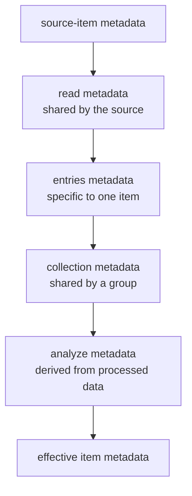

# Metadata and collections

Metadata and collections make data understandable and findable. They describe items without changing
the data itself.

## Metadata is an ordinary dictionary

Public callbacks receive metadata as a `Dict`. Keys name metadata fields and values contain their Julia
values:

```julia
Dict(
    :sample => "A17",
    :temperature_k => 4.2,
    :channel => "gate",
)
```

Projects can use the same dictionary syntax they use elsewhere in Julia. DataBrowser stores
queryable metadata and reconstructs it when a workspace reopens.

## Where metadata comes from

Metadata is accumulated through the pipeline:



Later values with the same key take precedence. Registration callbacks receive the metadata
accumulated before their stage. In the type API, data and metadata remain together in the concrete
item passed to `process(item)` and `analyze(item)`.

Metadata required to label, group, or immediately query an item should be supplied by the source
item or discovered by `read` or `entries`. Metadata that requires processed data belongs in
`analyze` and appears when that work finishes.

## Collections

A collection is a meaningful group of related items. It can represent a sample, device, session,
experiment, wafer position, or another grouping used by the project.

The `collection` callback returns a path from the broadest group to the most specific:

```julia
collection = (data::Measurement, metadata::Dict) -> ["Sample A", "Device 3"]
```

The browser displays this as:

```text
Sample A
└── Device 3
    ├── item 1
    └── item 2
```

Items in one collection remain independent. They may have different data types and different
visualizers. Collection operations provide the point where a project intentionally compares or
combines them.

## Labels

`label` returns the text shown for an individual item:

```julia
label = (data::Measurement, metadata::Dict) -> label::String
```

Labels are presentation, not identity. Changing a label does not create a different logical item.

## Stable item identity

DataBrowser generates an integer sibling key when `id` is omitted. This is sufficient when a source
always returns its items in the same order.

Use a stable domain key when sibling order can change:

```julia
id = (data::Measurement, metadata::Dict) -> metadata[:channel]
```

Stable keys keep annotations, selections, and cached results attached to the same logical item when
another sibling is inserted or the returned order changes.
