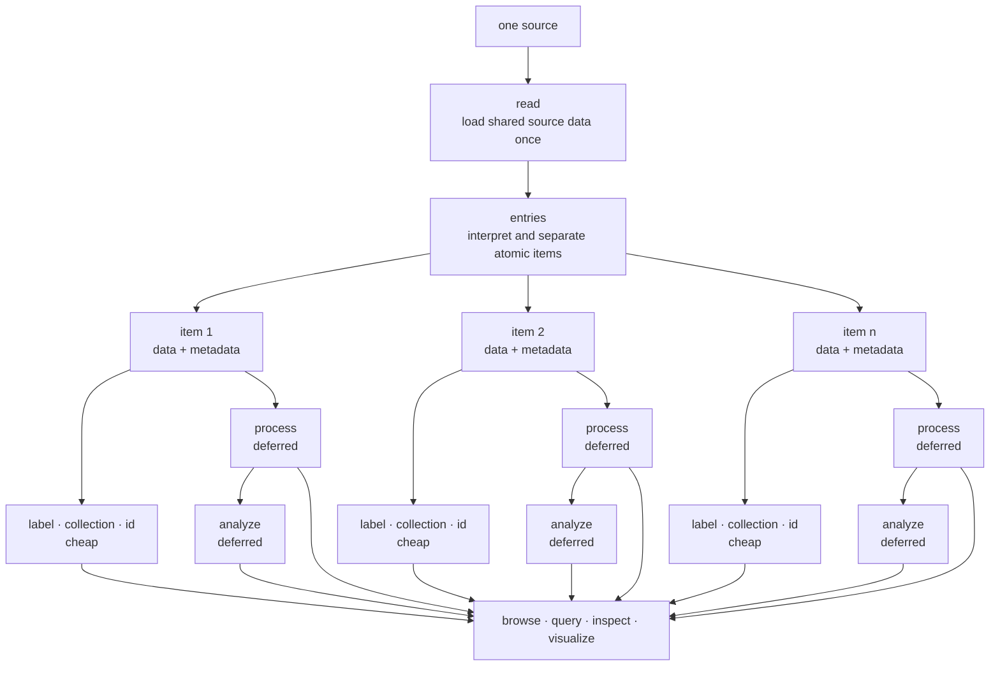

# How DataBrowser works

A DataBrowser project is a data pipeline. Data enters from a source, becomes one or more atomic
items, and is processed into values that the browser can inspect, query, and visualize.

Understanding this flow is more important than memorizing callback names.

## From one source to many items

One source does not necessarily equal one item. A file may contain one table, several measurement
channels, or hundreds of independent sweeps. A database row, remote object, completed simulation,
or stream channel can also be a source.

The first two stages establish the meaning of that source:

1. `read` loads information shared by everything in the source.
2. `entries` separates the loaded result into meaningful atomic items.

An atomic item is the smallest value the project wants users to select, process, annotate, query,
or visualize independently.

Fan-out happens at `entries`. The later stages run independently for every returned item.

## Data and metadata

Every item has data and metadata.

**Data** is the value the project operates on: a table, image, spectrum, waveform, model result, or
any other Julia value.

**Metadata** is an ordinary `Dict`. It contains facts used to understand and find the item, such as
a channel name, sample, temperature, timestamp, or extracted parameter.

Metadata can be learned at different times:

- `read` can discover facts shared by every item from a source;
- `entries` can discover facts while separating individual items;
- `analyze` can derive facts from processed data later.

Values discovered together are returned together. This prevents a cheap metadata callback from
having to repeat expensive interpretation.

## Which operations may be expensive?

The pipeline deliberately distinguishes scheduled work from cheap description.

| Operation | Purpose | Frequency | Cost expectation |
|---|---|---|---|
| `detect` | recognize sources handled by a registration | while matching a source | cheap |
| `read` | load shared source data | once per accepted source revision | may be expensive |
| `entries` | interpret and separate atomic items | once after `read` | may be expensive |
| `label` | choose display text | once while publishing an item | cheap |
| `collection` | choose the item's browser grouping | once while publishing an item | cheap |
| `id` | preserve stable sibling identity | once while publishing an item | cheap |
| `process` | transform one item's data | when requested or scheduled | may be expensive |
| `analyze` | derive searchable metadata | after processing | may be expensive |
| collection operations | operate on a related group | after member results are ready | may be expensive |

DataBrowser schedules the expensive stages, prioritizes requested work, and reuses persistent
results when possible. The cheap callbacks allow items to appear in the browser without waiting for
all deferred work to finish.

## What each stage means

### `read`: load the shared source

`read` performs work shared by all items from one source. File parsing, header reading, decompression,
and other source-wide work belong here.

### `entries`: decide what the items are

`entries` interprets the loaded result. It may slice a table into channels, divide an acquisition
into sweeps, or reject a source that contains no usable items. When interpretation reveals metadata,
it returns that metadata with the corresponding data.

If one source is already one item, `entries` is unnecessary.

### Cheap description: make items understandable

`label`, `collection`, and `id` receive an item's data and metadata. They do not perform another
interpretation pass.

- `label` controls the text shown to users.
- `collection` places related items together.
- `id` preserves identity when sibling order changes.

### `process`: prepare data for use

`process` transforms the atomic data into the representation consumed by inspectors and visualizers.
Cleaning, normalization, and repeatable transformations belong here.

### `analyze`: make processed data searchable

`analyze` receives the processed value and returns additional metadata. Expensive summaries,
quality checks, and extracted parameters belong here.

## Collections and workflows

A collection groups related atomic items. Collection operations can compare or combine members once
their item-level results are ready. A multimodal experiment can therefore keep spectra, images, and
electrical measurements as separate items while placing them in the same meaningful collection.

A workflow is interactive work performed with those items: fitting, parameter exploration,
comparison, or a saved sequence of operations. A workflow consumes the item pipeline; it is not an
extra stage forced into every item definition.
