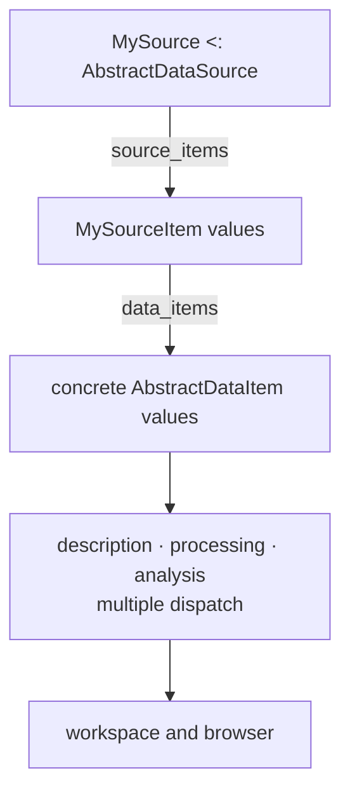

# Type API

The type API expresses a DataBrowser project through Julia types and multiple dispatch. It is the
fundamental interface beneath `register_item!` and the natural choice for domain packages, custom
sources, and projects that already have meaningful concrete types.

Type-based projects use the same pipeline described in [How DataBrowser works](pipeline.md). The
difference is that behavior dispatches on domain types instead of being stored as registered
callbacks.

## Data items

An `AbstractDataItem` represents one item. A concrete subtype can itself be the item's data:

```julia
struct Spectrum <: AbstractDataItem
    energy::Vector{Float64}
    intensity::Vector{Float64}
end
```

That definition is sufficient when source-derived defaults are appropriate. DataBrowser does not
convert the value to another public item type.

Projects implement only the behavior they need:

| Method | Receives | Produces | Default |
|---|---|---|---|
| `item_data` | one concrete item | its data | the item itself |
| `metadata` | one concrete item | metadata supplied by the item as a `Dict` | empty `Dict` |
| `item_label` | one concrete item | browser text | source-derived label |
| `collection` | one concrete item | collection path | source-derived path |
| `id` | one concrete item | stable sibling key | returned position |
| `process` | one concrete item | the item consumed by views | the item unchanged |
| `analyze` | one processed item | additional metadata as a `Dict` | empty `Dict` |
| `fingerprint` | one concrete item | an item-specific invalidation value | none |
| `cacheable` | one concrete item | whether its data can be persisted | determined by its data |

The complete signatures are:

```julia
item_data(item::MyItem)::MyData
metadata(item::MyItem)::Dict
item_label(item::MyItem)::String
collection(item::MyItem)::Vector{String}
id(item::MyItem)::Any
process(item::MyItem)::MyProcessedItem
analyze(item::MyProcessedItem)::Dict
fingerprint(item::MyItem)::Any
cacheable(item::MyItem)::Bool
```

Multiple dispatch replaces registration names as the behavior selector. Different item types can
provide entirely different processing and analysis methods while sharing one workspace.

`process(item)` and `analyze(item)` receive the concrete item itself. Metadata needed by those
methods belongs in that item or in the values it contains.

`metadata(::AbstractDataItem)` defaults to an empty `Dict`.

## Sources and source items

An `AbstractDataSource` owns discovery and optional live updates. Examples include a directory,
database, remote service, completed-run store, or streaming connection.

An `AbstractDataSourceItem` is one addressable unit discovered inside that source. It is the unit of
progress, source errors, and invalidation. One source item may produce zero, one, or many data items.



## Source interface

| Method | Purpose | Default |
|---|---|---|
| `source_id(source)` | stable identity for workspace and cache ownership | required |
| `source_label(source)` | user-facing source name | required |
| `source_items(source)` | discover the current source items | required |
| `open_source(source)` | acquire source resources | the source itself |
| `close_source!(source)` | release files, connections, tasks, or streams | nothing |
| `watch_source(source, on_change; cancel_token)` | publish later source changes | static source |
| `source_open_options(source)` | values needed to reopen an equivalent source | empty named tuple |

The method signatures are:

```julia
source_id(source::MySource)::String
source_label(source::MySource)::String
source_items(source::MySource)::Vector{MySourceItem}
open_source(source::MySource)::MySource
close_source!(source::MySource)::Nothing
watch_source(source::MySource, on_change; cancel_token)::Nothing
source_open_options(source::MySource)::NamedTuple
```

`open_source` returns the opened source because an immutable description may open a different value
that owns live resources. `close_source!` releases those resources.

## Source-item interface

| Method | Purpose | Default |
|---|---|---|
| `source_item_id(item)` | stable identity within its source | required |
| `source_item_label(item)` | name used for progress and errors | required |
| `fingerprint(item)` | detect changes to this source item | always reinterpret |
| `source_item_path(item)` | expose a filesystem path when one exists | nothing |
| `source_item_timestamp(item)` | expose acquisition or modification time | nothing |
| `metadata(item)` | metadata supplied directly by this source item | empty `Dict` |

The method signatures are:

```julia
source_item_id(item::MySourceItem)::String
source_item_label(item::MySourceItem)::String
fingerprint(item::MySourceItem)::Any
source_item_path(item::MySourceItem)::Union{Nothing,String}
source_item_timestamp(item::MySourceItem)::Any
metadata(item::MySourceItem)::Dict
```

`metadata(::AbstractDataSourceItem)` defaults to an empty `Dict`. `data_items` receives the source
item, so it can place any metadata needed during processing into each returned data item.

## Interpretation

`data_items` connects source discovery to the item pipeline:

```julia
data_items(
    project,
    source::MySource,
    source_item::MySourceItem,
)::Vector{<:AbstractDataItem}
```

It performs the type API's source reading and item separation together. The returned concrete domain
values then provide their own description, processing, analysis, and caching behavior through
multiple dispatch.

## Choosing between APIs

WIP
