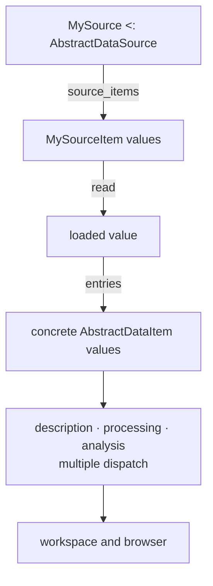

# Type API

The type API expresses a DataBrowser project through Julia types and multiple dispatch. It is the
fundamental interface beneath `register_item!` and the natural choice for domain packages, custom
sources, and projects that already have meaningful concrete types.

Type-based projects use the same pipeline described in [How DataBrowser works](pipeline.md). The
difference is that behavior dispatches on domain types instead of being stored as registered
callbacks.

## Data items

An `AbstractDataItem` represents one item. A concrete subtype can itself be the item's data:

```julia
struct Spectrum <: AbstractDataItem
    energy::Vector{Float64}
    intensity::Vector{Float64}
    temperature_k::Float64
end
```

That definition is sufficient when source-derived defaults are appropriate. DataBrowser does not
convert the value to another public item type.

Metadata does not need to be stored in a `Dict`. A concrete item can keep it in typed fields and
expose the fields that should be indexed:

```julia
metadata(spectrum::Spectrum) = Dict(
    :temperature_k => spectrum.temperature_k,
    :point_count => length(spectrum.energy),
)
```

The `Dict` is the metadata view consumed by DataBrowser; it does not constrain how the concrete
item stores its values.

Projects implement only the behavior they need:

| Method | Receives | Produces | Default |
|---|---|---|---|
| `item_data` | one concrete item | its data | the item itself |
| `metadata` | one concrete item | metadata supplied by the item as a `Dict` | empty `Dict` |
| `label` | one concrete item | browser text | source-derived label |
| `collection` | one concrete item | complete vector of `AbstractCollection` values | empty root path |
| `id` | one concrete item | its identity | **required** |
| `process` | one concrete item | the item consumed by views | the item unchanged |
| `analyze` | one processed item | additional metadata as a `Dict` | empty `Dict` |
| `reconstruct` | the item's type, its stored id, a cached payload, and metadata | the rebuilt item, or `nothing` | `nothing`; upstream stages rerun |

The complete signatures are:

```julia
id(item::MyItem)::String
item_data(item::MyItem)::MyData
metadata(item::MyItem)::Dict
label(item::MyItem)::String
collection(item::MyItem)::Vector{<:AbstractCollection}
process(item::MyItem)::MyProcessedItem
analyze(item::MyProcessedItem)::Dict
reconstruct(::Type{MyItem}, id, data, metadata::Dict)::MyItem
```

Data is persisted whenever the cache can store its shape; no opt-in predicate is involved. A cached
payload is delivered to views without running project code either way. `reconstruct` is needed only
to run a *further* stage on a cached item — implement it and reopening rebuilds items at
deserialization speed, omit it and the engine reruns `read` → `entries` → `process`, which is always
correct and only slower. It must be a pure function of what was cached, so anything the type needs
to rebuild itself belongs in its metadata. `T` is never looked up: the item record carries the
concrete type, so `reconstruct` is dispatched on the type the item actually had.

## Collection types

A collection is a grouping level a project defines so it can process and analyze the same items
different ways — by device in one level, by temperature in another. Collection stages dispatch on
the collection value, so a project writes one type per grouping:

```julia
struct Device <: AbstractCollection
    name::String
end

id(device::Device)::String = device.name
label(device::Device)::String = device.name
metadata(device::Device)::Dict = Dict()
reconstruct(::Type{Device}, id::AbstractString, ::Dict)::Device = Device(String(id))

process(device::Device, items::AbstractVector)::Vector{<:AbstractDataItem}
analyze(device::Device, items::AbstractVector)::Dict
```

`process` rewrites the members, returning one output per input **in the same order**; the default
returns them unchanged. `analyze` folds them into metadata attached to the collection node; the
default is empty. Both run whenever they are defined — there is nothing to declare or enable.

`reconstruct` is required here and has no default, unlike the item method. An item that cannot be
rebuilt is recreated by rerunning `read` → `entries`; a collection has no such path, so a missing
method is an error rather than a slow path, and it fires from the first interpretation rather than
after reopening. It receives the stored `id` and the level's own metadata — everything the row keeps
about the value, since the occurrence ID is a one-way digest of the parent ID, the type, and
`id(collection)`.

Display text is never involved: two levels may legitimately share a `label`, so anything beyond the
identity that a type needs — a display string, a numeric parameter — belongs in `metadata`.

Multiple dispatch replaces registration names as the behavior selector. Different item types can
provide entirely different processing and analysis methods while sharing one workspace.

`process(item)` and `analyze(item)` receive the concrete item itself. Metadata needed by those
methods belongs in that item or in the values it contains.

`metadata(::AbstractDataItem)` defaults to an empty `Dict`.

## Collections

One `AbstractCollection` value represents one hierarchy level. `collection(item)` always returns
the complete root-to-leaf vector; use an empty vector for the root and `[collection]` for a flat
hierarchy. Different levels may have different concrete types by returning an
`AbstractCollection[...]` vector.

```julia
struct Session <: AbstractCollection
    started_at::DateTime
end

struct ParameterSet <: AbstractCollection
    temperature_k::Float64
end

label(session::Session) = string(session.started_at)
metadata(parameters::ParameterSet) = Dict(:temperature_k => parameters.temperature_k)

collection(item::MyItem) = AbstractCollection[item.session, item.parameters]
```

`label(collection)` defaults to Julia's normal text representation and
`metadata(collection)` defaults to an empty `Dict`. `id(collection)` defaults to the complete
collection value. DataBrowser canonically encodes that result together with the concrete collection
type and parent identity, so ordinary immutable structs require no identity method.

Override `id` only when some fields are display or metadata rather than identity, or when the full
value contains state that cannot be canonically encoded:

```julia
id(session::Session) = Dates.value(session.started_at)
```

The override may return an integer or another supported stable value. Julia `==`, `isequal`, and
`hash` remain available for the type's own semantics, but do not determine hierarchy coalescing.

## Sources and source items

An `AbstractDataSource` owns discovery and optional live updates. Examples include a directory,
database, remote service, completed-run store, or streaming connection.

An `AbstractDataSourceItem` is one addressable unit discovered inside that source. It is the unit of
progress, source errors, and invalidation. One source item may produce zero, one, or many data items.


```mermaid
flowchart TB
    source["MySource <: AbstractDataSource"] -->|"source_items"| source_items["MySourceItem values"]
    source_items -->|"read"| loaded["loaded value"]
    loaded -->|"entries"| items["concrete AbstractDataItem values"]
    items --> dispatch["description · processing · analysis<br/>multiple dispatch"]
    dispatch --> workspace["workspace and browser"]
```

## Source interface

| Method | Purpose | Default |
|---|---|---|
| `source_id(source)` | stable identity for workspace and cache ownership | required |
| `source_label(source)` | user-facing source name | required |
| `source_items(source)` | discover the current source items | required |
| `open_source(source)` | acquire source resources | the source itself |
| `close_source!(source)` | release files, connections, tasks, or streams | nothing |
| `watch_source(source, on_change; cancel_token)` | publish later source changes | static source |
| `source_open_options(source)` | values needed to reopen an equivalent source | empty named tuple |

The method signatures are:

```julia
source_id(source::MySource)::String
source_label(source::MySource)::String
source_items(source::MySource)::Vector{MySourceItem}
open_source(source::MySource)::MySource
close_source!(source::MySource)::Nothing
watch_source(source::MySource, on_change; cancel_token)::Nothing
source_open_options(source::MySource)::NamedTuple
```

`open_source` returns the opened source because an immutable description may open a different value
that owns live resources. `close_source!` releases those resources.

## Source-item interface

| Method | Purpose | Default |
|---|---|---|
| `id(item)` | stable identity within its source | required |
| `label(item)` | name used for progress and errors | required |
| `fingerprint(item)` | detect changes to this source item | always reinterpret |
| `source_item_path(item)` | expose a filesystem path when one exists | nothing |
| `source_item_timestamp(item)` | expose acquisition or modification time | nothing |
| `metadata(item)` | metadata supplied directly by this source item | empty `Dict` |

The method signatures are:

```julia
id(item::MySourceItem)::String
label(item::MySourceItem)::String
fingerprint(item::MySourceItem)::Any
source_item_path(item::MySourceItem)::Union{Nothing,String}
source_item_timestamp(item::MySourceItem)::Any
metadata(item::MySourceItem)::Dict
```

`metadata(::AbstractDataSourceItem)` defaults to an empty `Dict`. `entries` receives the source
item, so it can place any metadata needed during processing into each returned data item.

## Interpretation

Two stages connect source discovery to the item pipeline:

```julia
read(source::MySource, source_item::MySourceItem)               # -> your loaded value
entries(source_item::MySourceItem, loaded::MyLoaded)            # -> Vector{<:AbstractDataItem}
```

`read` performs the one expensive source operation. `entries` expands its result into zero, one, or
many items without going back to the origin. The returned concrete domain values then provide their
own description, processing, analysis, and caching behavior through multiple dispatch.

**The source appears exactly once, at `read`.** Everything after it is a pure function of values,
which is what lets a cached stage result stand on its own — rerunning `entries` without rereading,
warm reopen, and eviction recovery are sound by construction rather than by discipline. A `read`
returning a live handle (an HDF5 group, a database cursor) is fine, but that value is not cacheable;
such a project's durable boundary is `process` instead.

`entries` still receives the source item because identity is not payload: the loaded value stays
purely the expensive data, while default ids, labels, and collection placement derive from the
source item, which the engine can supply without touching the origin.

Both stages also have project-aware forms — `read(project, source, item)` and
`entries(project, item, loaded)` — for a project that reuses a shared source such as
`DirectorySource` and therefore dispatches on its own project type instead of its own source type.
A project type is any `struct MyProject <: AbstractProject`; it needs no fields, and
`project_name` defaults to the type's name.

## Choosing between APIs

WIP
